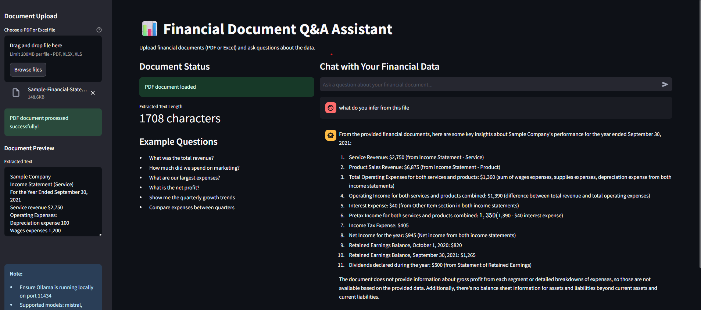

# 📊 Financial Document Q&A Assistant

  
  
  
  

A powerful web application that processes financial documents and provides intelligent question-answering capabilities using local language models—all while maintaining complete data privacy.

---

## 🚀 Why This Project Is Unique

### 🔒 Complete Data Privacy  
Unlike most AI applications that send your sensitive financial data to external servers, this tool processes everything locally on your machine. Your financial documents never leave your environment, making it ideal for handling confidential corporate financial data.

### 📊 Specialized Financial Intelligence  
This isn't just another generic chatbot—it's specifically engineered to understand financial terminology, extract key metrics from financial statements, and provide accurate answers about:  

- Revenue and sales figures  
- Expense breakdowns and analysis  
- Profit margins and financial ratios  
- Balance sheet items  
- Cash flow statements  
- Quarterly and annual comparisons  

### 🏗️ Local LLM Integration  
Leverages **Ollama** with local small language models (SLMs) instead of relying on cloud-based APIs. This provides:  

- No dependency on internet connectivity  
- No API costs or usage limits  
- Customizable model selection based on your hardware capabilities  
- Complete control over the AI processing  

### ⚡ Multi-Format Document Processing  
Seamlessly handles both **PDF and Excel** formats—the two most common for financial documentation. The system can process:  

- Income statements  
- Balance sheets  
- Cash flow statements  
- Financial reports with various layouts  
- Multi-sheet Excel workbooks  

### 💬 Conversational Financial Analysis  
Provides an interactive chat experience that understands context and follow-up questions, enabling true conversational analysis of your financial data.

---

## 📋 Features

- 📂 **Document Upload:** Support for PDF and Excel financial documents  
- 📝 **Text Extraction:** Advanced extraction from complex financial layouts  
- 🔍 **Natural Language Queries:** Ask questions in plain English about your financial data  
- 💬 **Conversational Context:** Maintains conversation history for follow-up questions  
- 🖥️ **Local Processing:** All AI processing happens on your local machine  
- 🎨 **Responsive UI:** Clean, intuitive web interface built with Streamlit  
- ⚠️ **Error Handling:** Robust error handling and user feedback  

---

## 🛠️ Technology Stack

- **Frontend:** Streamlit  
- **Document Processing:** pdfplumber (PDF), pandas (Excel)  
- **Language Model:** Ollama with local LLMs (Mistral, Llama2, or custom models)  
- **Data Handling:** pandas for financial data manipulation  
- **API Communication:** requests for Ollama API integration  

---

## 📸 Demo

  
*Example of the application processing a financial document and answering questions.*

---

## 🚀 Getting Started

### Prerequisites
- Python **3.8+**  
- **Ollama** installed locally  
- At least one language model pulled via Ollama (e.g., `ollama pull mistral`)  

### Installation

Clone the repository:
```bash
git clone https://github.com/yourusername/financial-qa-assistant.git
cd financial-qa-assistant
```

### Create a virtual environment and install dependencies:

```bash
python -m venv venv
source venv/bin/activate  # On Windows: venv\Scripts\activate
pip install -r requirements.txt
```
### Ensure Ollama is running:

```bash
ollama serve
```

```bash
streamlit run financial_qa_assistant.py
```
### 💡 Usage

- Upload a financial document (PDF or Excel) using the sidebar

- Wait for the document to be processed (you'll see a preview)

- Start asking questions about your financial data in the chat interface

- Explore follow-up questions based on previous answers

### Example Questions:

- "What was the total revenue in Q4?"

- "Show me the expense breakdown by category"

- "What is our net profit margin?"

- "Compare marketing expenses between quarters"

- "What are our current assets and liabilities?"

### 🏗️ Project Structure

financial-qa-assistant

├── financial_qa_assistant.py    # Main application file

├── requirements.txt             # Python dependencies

├── README.md                    # Project documentation

├── assets/                      # Additional resources

├── demo-screenshot.png          # Application screenshot

### 🔧 Customization

- This project is highly customizable:

- Model Selection: Switch between different Ollama models

- Prompt Engineering: Modify the financial analysis prompts

- UI Enhancements: Extend the Streamlit interface with additional features

Document Processing: Add support for additional file formats
